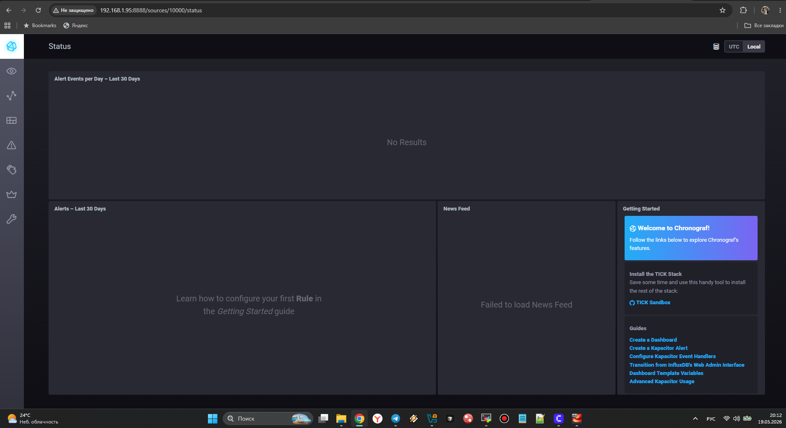
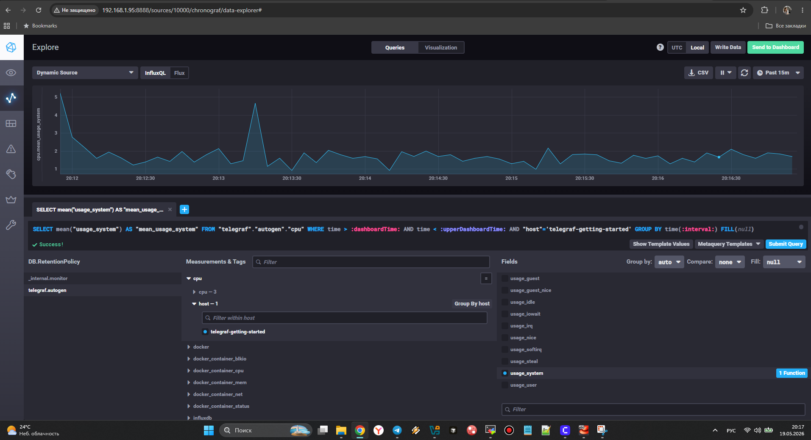
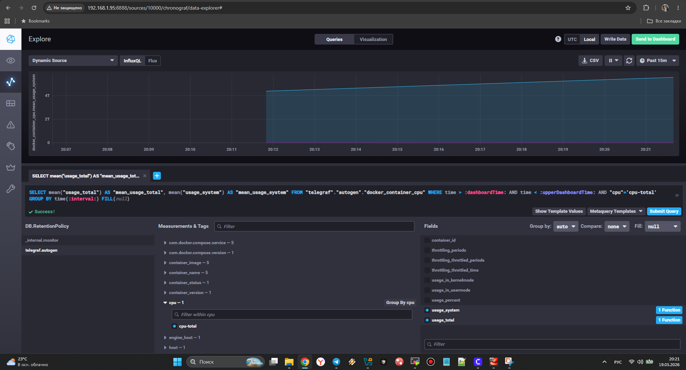

## Домашнее задание к занятию 13 «Введение в мониторинг»

## Задание 1
Минимальный набор метрик

Проект:
- Запросы отправляются по HTTP
- Система считает и выдает текстовый отчет
- Отчет сохраняется на диск
- Вычисления сильно нагружают процессор

Минимальный набор метрик:

- HTTP-коды ответов (200, 400, 500) — Чтобы видеть, сколько запросов успешные, а сколько упали
- Время выполнения запроса — Чтобы понять, не стало ли все работать медленно
- Загрузка CPU — Основная причина тормозов — вычисления
- Свободное место на диске — Без места не сохранить отчет — это фактический отказ
- Количество активных вычислений — Чтобы видеть нагрузку на систему

**Вывод:** Этот минимум позволяет понять — система работает, доступна и выдает результаты.

---

## Задание 2
Метрики для менеджера продукта (SLA/SLO)

Вместо технических метрик показывать пользовательские:

| Техническая метрика | Заменяем на |
|---------------------|-------------|
| RAM, CPU | Скорость ответа клиенту |
| Коды ответов | Доля успешных запросов (например, 99%) |
| Inodes (свободные узлы на диске) | Сможет ли система сохранить новый отчет |

**Пример дашборда для менеджера (3 цифры):**
- Доступность — % успешных ответов
- Скорость — за сколько секунд клиент получает отчет
- Результат — сколько отчетов сформировано за день

---

## Задание 3
Решение для логов ошибок

**Минимальный вариант (самый простой):**

Приложение пишет ошибки в stderr, а системный systemd (или супервизор) перехватывает stderr, затем настроить ротацию логов через logrotate.

Недостаток: разработчикам придётся заходить на сервер и смотреть:
- `journalctl -u your-app`
- или `tail -f /var/log/app/error.log`

**Бесплатное решение (push-модель на уровне кода):**

- Написать маленький скрипт/воркер внутри приложения, который при ошибке шлет HTTP POST в простого бота
- Или складывать ошибки в SQLite и периодически отправлять через бесплатный SMTP на почту разработчиков

---

## Задание 4
Ошибка в формуле SLA

**Вероятные причины:**

- Коды 3xx (редиректы) — Клиента перенаправили на другой адрес — это не успех
- Коды 1xx (информационные) — это не готовый отчет

**Как исправить:**

- Считать только успешные запросы, например: только 200 OK
- Исключить 3xx, 1xx

## Задание 5
Плюсы и минусы Pull и Push систем

| Критерий | Pull | Push |
|----------|--------------|----------------|
| **Как работает** | Сервер сам забирает метрики с клиентов | Клиент сам отправляет метрики на сервер |
| **Главный плюс** | Сервер контролирует процесс, легко проверить доступность клиента | Клиенты за фаерволом/NAT могут отправлять данные |
| **Главный минус** | Нужно открывать доступ к клиентам извне | Клиенты могут перегрузить сервер данными |
| **Когда выбирать** | Если все серверы видны из сети мониторинга (облако, ЦОД) | Если серверы скрыты за NAT, либо есть короткоживущие задачи |
| **Пример системы** | Prometheus, Nagios | InfluxDB (TICK), Graphite |

## Задание 6
Какая система к какой модели относится

| Система | Модель | Пояснение |
|---------|--------|-----------|
| **Prometheus** | Pull | Сервер сам опрашивает клиентов (есть Pushgateway как исключение) |
| **TICK** (Telegraf + InfluxDB) | Push | Telegraf отправляет метрики в InfluxDB |
| **Zabbix** | Гибридная | Сервер опрашивает агентов (pull), но агенты могут отправлять активные проверки (push) |
| **VictoriaMetrics** | Гибридная | Умеет pull из Prometheus и принимать push от других систем |
| **Nagios** | Pull | Сервер опрашивает удаленные серверы через NRPE |

**Простое правило:**
- Указываем IP клиентов → скорее всего **Pull**
- Клиенты указывают IP сервера → скорее всего **Push**
- Можно и так, и так → **Гибридная**

## Задание 7

  
   

## Задание 8

  
   

## Задание 9

  
   

